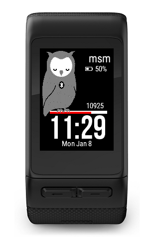
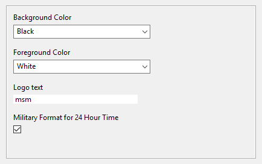

# garmin-m8m
Garmin Vivoactive HR smart watch family application

# Table of Contents
1. [Screenshots](#screenshots)
* [Features](#features)
* [Settings](#settings)
* [Screen legend](#screen-legend)

## Screenshots

## Features
* Blinking eyes owl
* Customizable three letters logo
* Battery status
* Bluetooth status
* Steps count
* Steps bar as percent from daily goal
* Time
* Date

## Settings
The alerts on bluetooth and battery will be painted in red. The same color is applied to Steps Bar evolution.

## Screen Legend

