# garmin-m8m 0.0.2
Garmin smart watch application.

# Table of Contents
1. [Presentation](#presentation)
2. [Features](#features)
3. [Settings](#settings)
4. [Screen legend](#screen-legend)
5. [Localization](#localization)
6. [Garmin store](#garmin-store)
7. [Supported models](#supported-models)
8. [Screenshots](#screenshots)

## Presentation

## Features
* Blinking eyes owl
* Customizable three letters logo
* Battery status
* Bluetooth status
* Steps count
* Steps bar as percent from daily goal
* Time
* Date
* Customizable colors

## Settings

### Background color
The background color for the watch face

### Foreground color
The color for all texts and symbols (battery, bluetooth, steps bar layout)

### Alert color
The color for:
* progress on the steps bar
* low level battery
* disconnected bluetooth
* owl eyes when wide

### Miltary format for 24 hours
Available only when the watch is set to output 24-hour time. 
In this case the double column is removed.

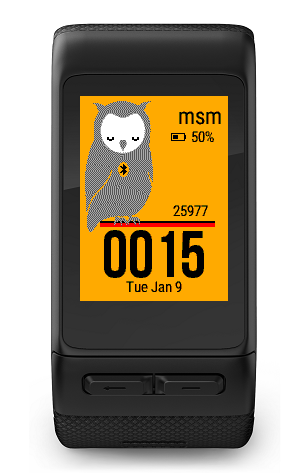

## Screen Legend
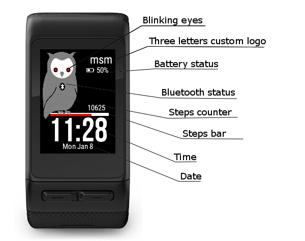

## Localization
Available languages:
* english
* french
* german

## Garmin store
The application may be downloaded from the Garmin store.
[https://apps.garmin.com/en-US/apps/b18ed990-4d72-437f-837c-1f3dcef1ad5a](https://apps.garmin.com/en-US/apps/b18ed990-4d72-437f-837c-1f3dcef1ad5a)

## Supported models
* Vivoactive
* Vivoactive HR
* Vivoactive 3
* Approach 60
* Fenix 5
* Fenix 5x
* Forerunner 935

## Screenshots

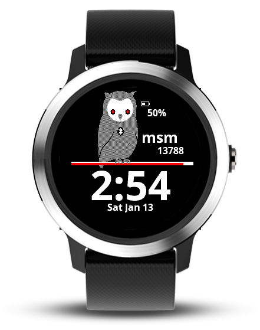
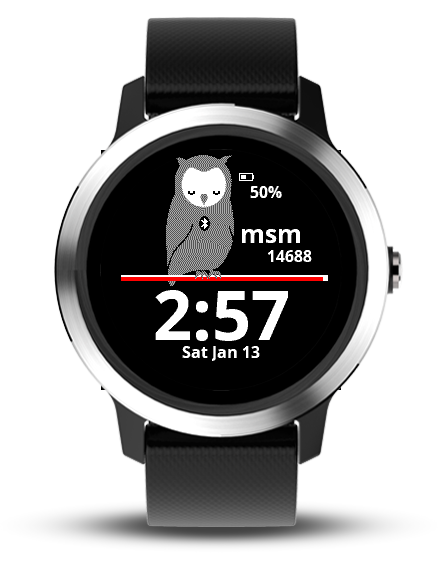
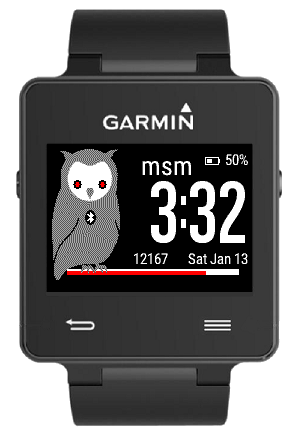
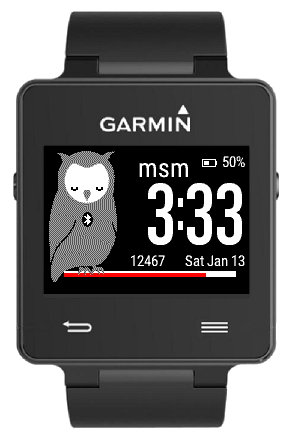
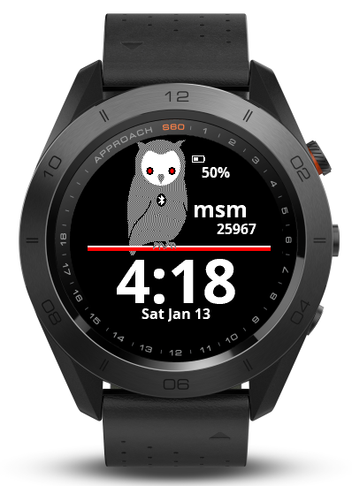
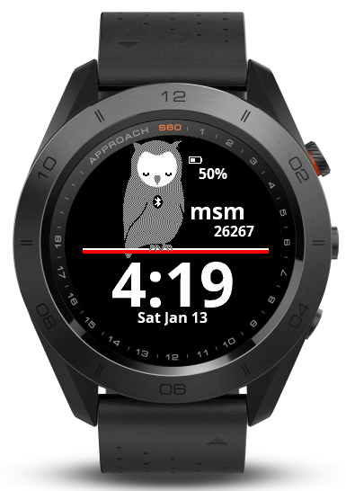
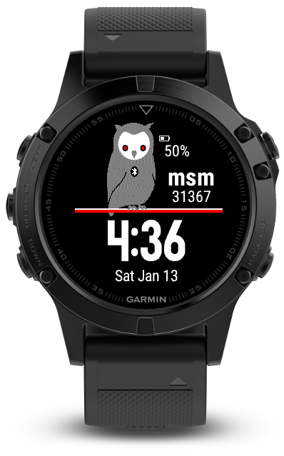
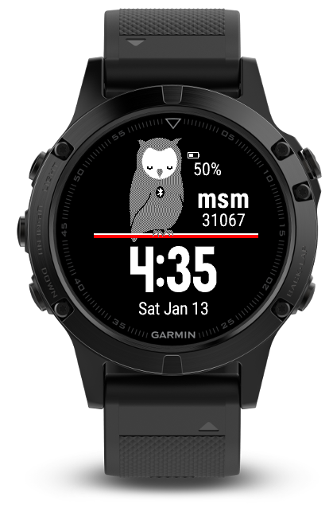
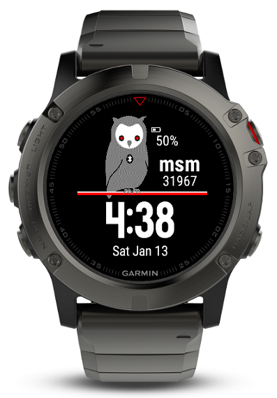
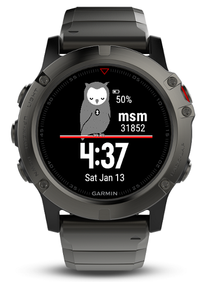
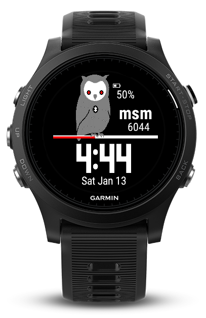
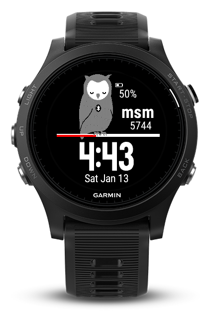

