# garmin-m8m 0.0.4
Garmin smart watch application.

# Table of Contents
1. [Presentation](#presentation)
2. [Features](#features)
3. [Settings](#settings)
4. [Screen legend](#screen-legend)
5. [Localization](#localization)
6. [Garmin store](#garmin-store)
7. [Supported models](#supported-models)
8. [Screenshots](#screenshots)

## Presentation

## Features
* Blinking eyes owl
* Customizable three letters logo
* Battery status
* Bluetooth status
* Steps count
* Steps bar as percent from daily goal
* Time
* Date
* Customizable colors

## Settings

### Setting process
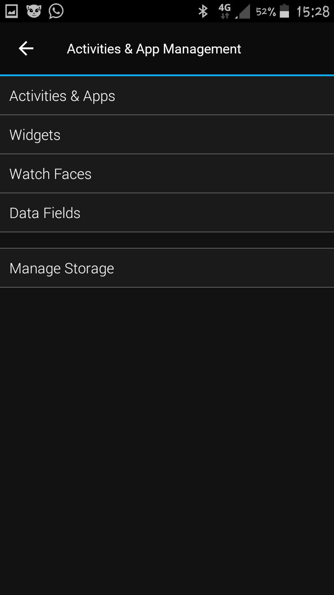
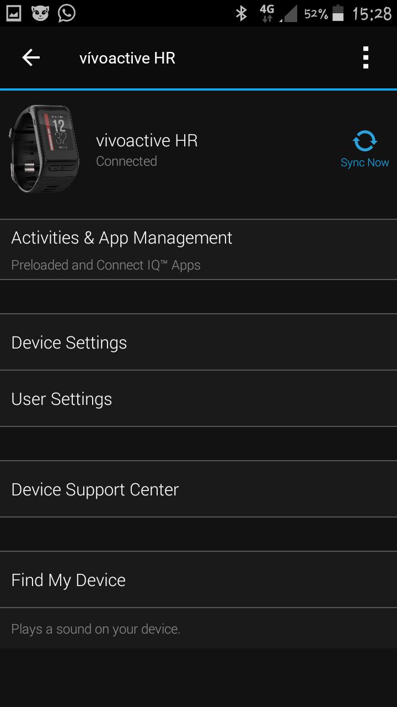
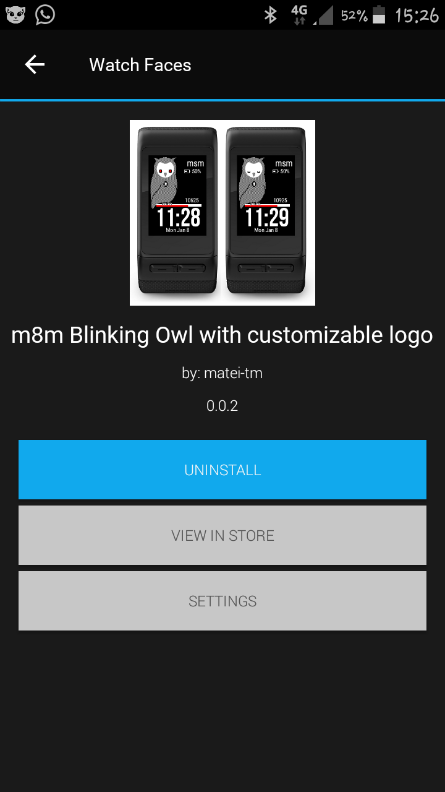
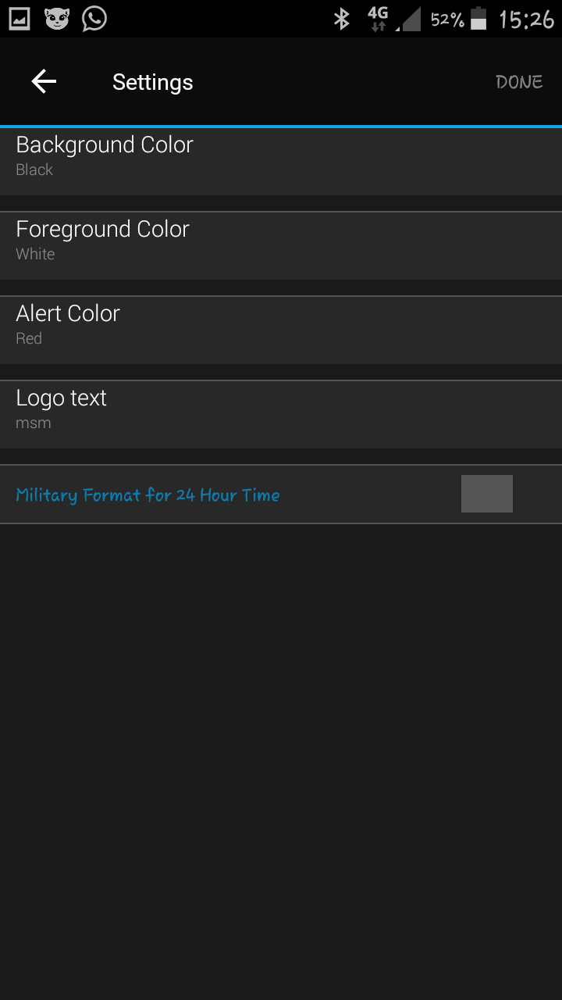
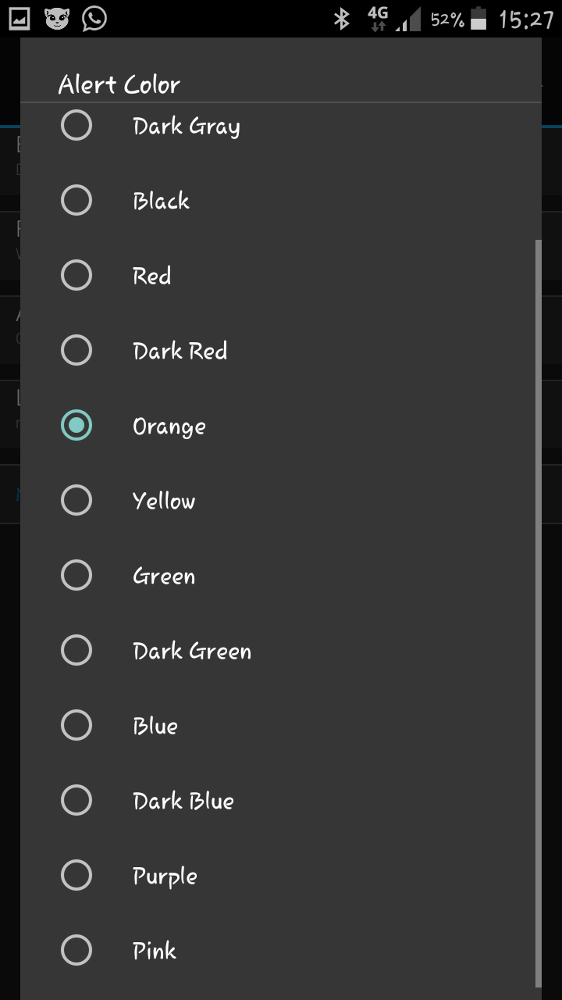
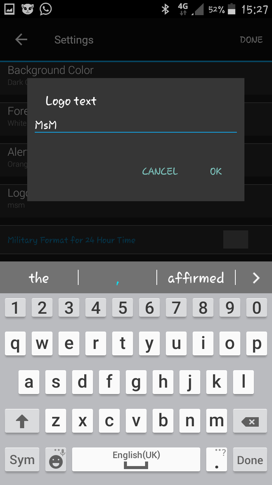
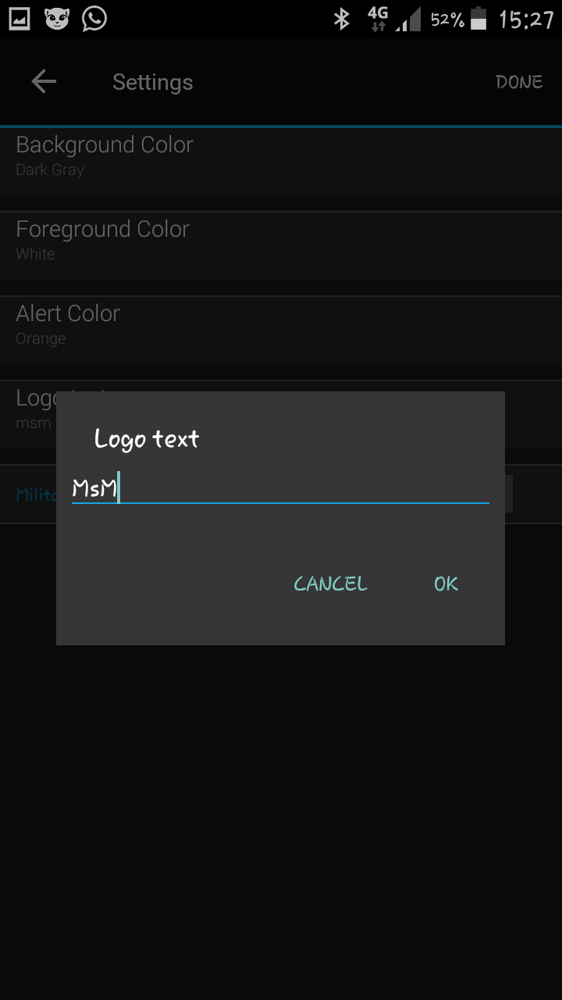

### Background color
The background color for the watch face

### Foreground color
The color for all texts and symbols (battery, bluetooth, steps bar layout)

### Alert color
The color for:
* progress on the steps bar
* low level battery
* disconnected bluetooth
* owl eyes when wide

### Miltary format for 24 hours
Available only when the watch is set to output 24-hour time. 
In this case the double column is removed.

## Screen Legend

## Localization
Available languages:
* english
* french
* german

## Garmin store
The application may be downloaded from the Garmin store.
[https://apps.garmin.com/en-US/apps/b18ed990-4d72-437f-837c-1f3dcef1ad5a](https://apps.garmin.com/en-US/apps/b18ed990-4d72-437f-837c-1f3dcef1ad5a)

## Supported models
* [Vivoactive](#vivoactive)
* [Vivoactive HR](#vivoactive-hr)
* [Vivoactive 3](#vivoactive-3)
* [Approach 60](#approach-60)
* [Fenix 5](#fenix-5)
* [Fenix 5x](#fenix-5x)
* [Forerunner 935](#forerunner-935)
* [Fenix 3](#fenix-3)
* [Fenix 5s](#fenix-5s)
* [Fenix Chronos](#fenix-chronos)
* [Fenix Epix](#fenix-epix)
* [Forerunner 920xt](#forerunner-920xt)
* [Forerunner 230](#forerunner-230)
* [Forerunner 235](#forerunner-235)
* [Forerunner 630](#forerunner-630)
* [Forerunner 735](#forerunner-735)
* [D2 Bravo](#d2-bravo)
* [D2 Bravo Charlie](#d2-bravo-charlie)
* [D2 Bravo Titanium](#d2-bravo-titanium)

## Screenshots
### Vivoactive HR

### Vivoactive 3

### Vivoactive

### Approach 60

### Fenix 5

### Fenix 5x

### Forerunner 935

### Fenix 3
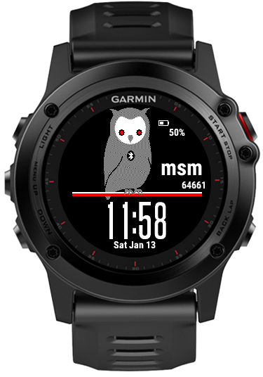
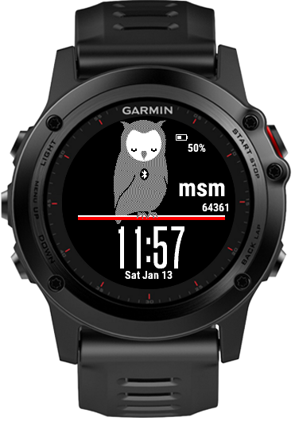
### Fenix 5s
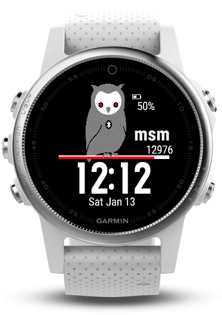
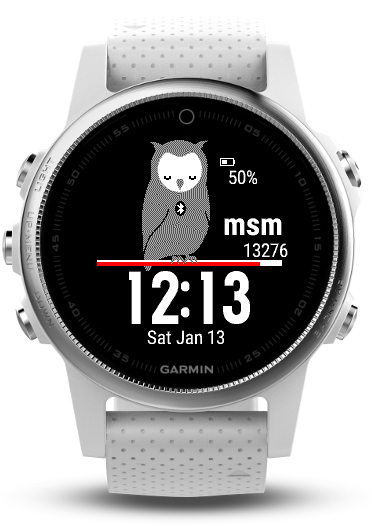
### Fenix Chronos
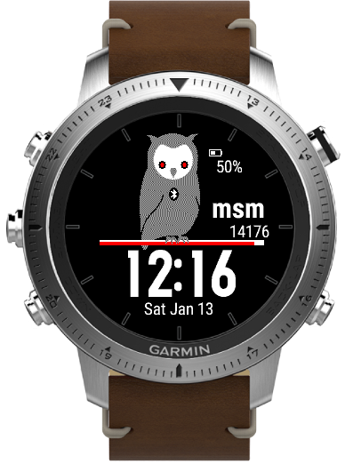
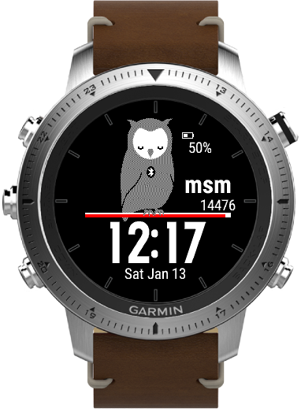
### Fenix Epix

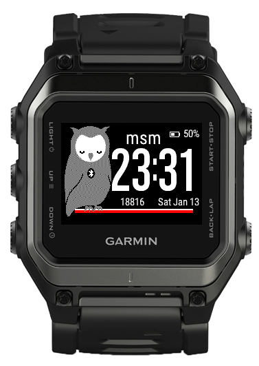
### Forerunner 920xt
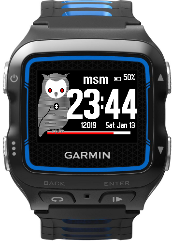
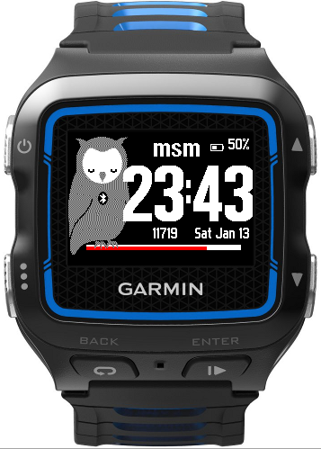
### Forerunner 230
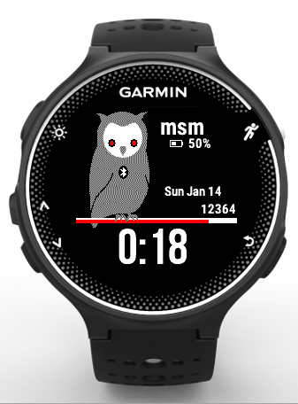
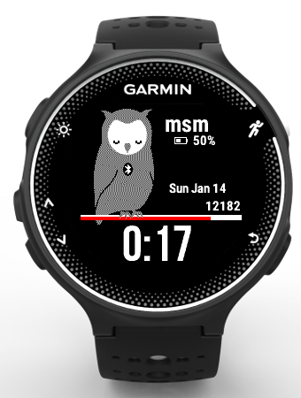
### Forerunner 235
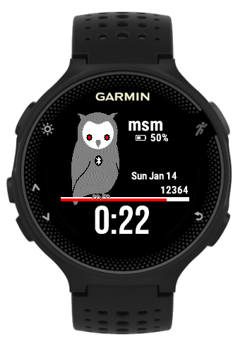
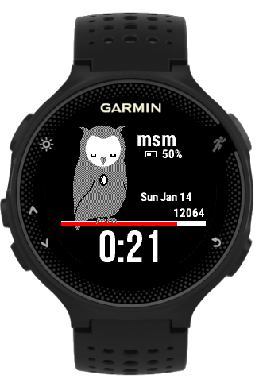
### Forerunner 630
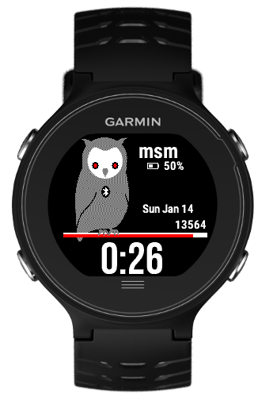
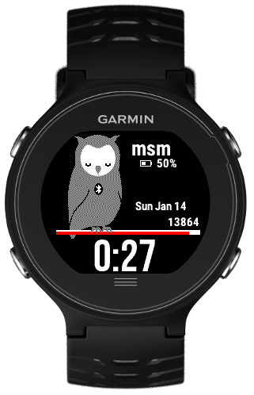
### Forerunner 735
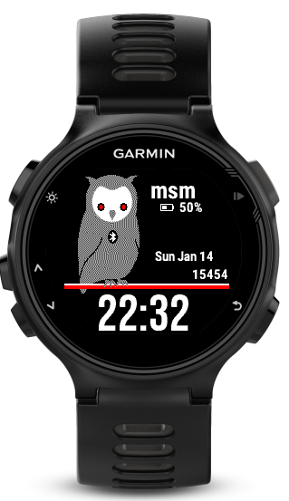
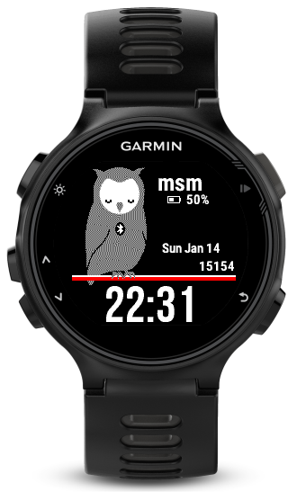
### D2 Bravo
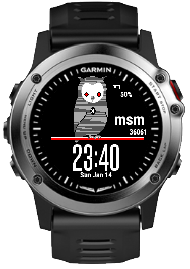
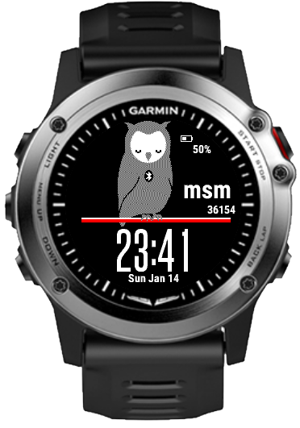
### D2 Bravo Charlie
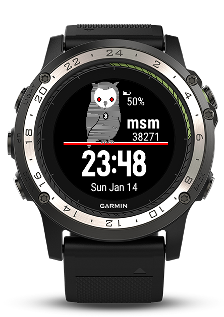
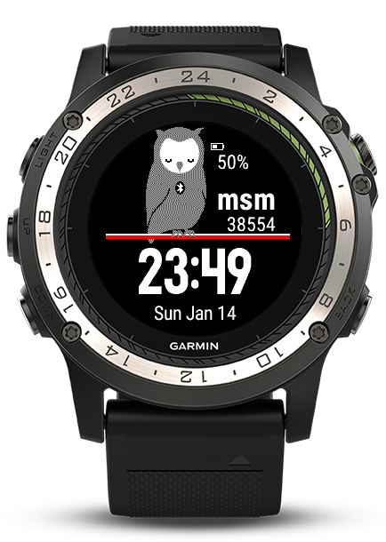
### D2 Bravo Titanium
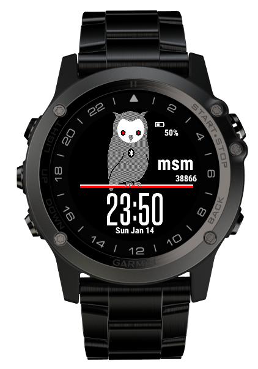
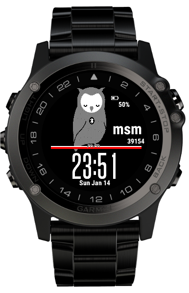
