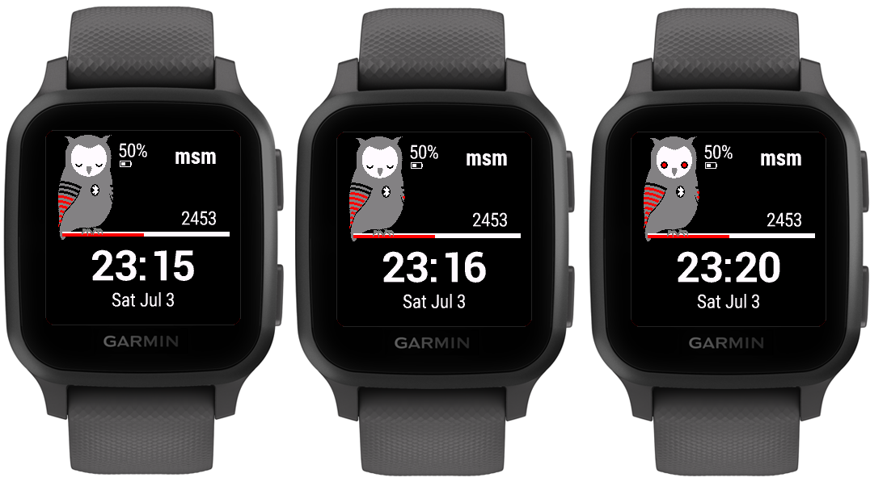
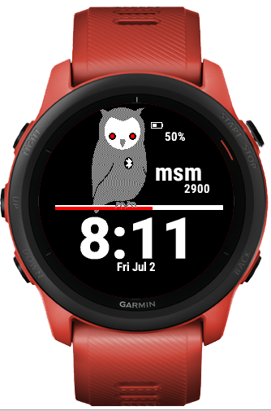

# garmin-m8m

  

Garmin smart watch application.
For each 10 minutes, the owl has its eyes wide open for as long as the percent activity from the step goal. (i.e. if your activity is 20 percent of the step goal, the owl will stay awake the minutes 0, 1 and 2 in each ten minute decade)

## Table of Contents

1. [Presentation](#presentation)
2. [Features](#features)
3. [Settings](#settings)
4. [Screen legend](#screen-legend)
5. [Localization](#localization)
6. [Garmin store](#garmin-store)
7. [Supported models](#supported-models)
8. [Screenshots](#screenshots)

## Presentation

## Features

* Blinking eyes owl
* Customizable three letters logo
* Battery status
* Bluetooth status
* Steps count
* Steps bar as percent from daily goal
* Time
* Date
* Customizable colors
* Wings decoration options:
  * Static 1
  * Static 2
  * Floors Climbed
  * Heart Rate

## Settings

Using mobile app Garmin Connect: [https://github.com/matei-tm/garmin-m8m/wiki/Changing-settings-from-Garmin-Connect-mobile-app](https://github.com/matei-tm/garmin-m8m/wiki/Changing-settings-from-Garmin-Connect-mobile-app)

Using computer app Garmin Express for Windows or Mac: [https://github.com/matei-tm/garmin-m8m/wiki/Changing-settings-from-Garmin-Express-for-Windows-or-Mac](https://github.com/matei-tm/garmin-m8m/wiki/Changing-settings-from-Garmin-Express-for-Windows-or-Mac)

### Logo text

The three letters customizable logo

### Background color

The background color for the watch face

### Foreground color

The color for all texts and symbols (battery, bluetooth, steps bar layout)

### Alert color

The color for:

* progress on the steps bar
* low level battery
* disconnected bluetooth
* owl eyes when wide

### Owl's Face color

The owl face color

### Owl's Eyes Contour Color

The owl eyes contour color

### Owl's Eyes Color

The owl eyes color

### Military format for 24 hours

Available only when the watch is set to output 24-hour time. 
In this case the double column is removed.

### Wings decoration options

* Static 1
* Static 2
* Floors Climbed
* Heart Rate

The decorative wings

If Floors Climbed is selected, each red strip is a ten percent from the goal

If HR active wings option is selected, then each red stripe is ten beats range.
The HR is divided in two zones: comfort (0-100) and training (100+)

## Screen Legend

## Localization

Available languages:

* english
* french
* german

## Garmin store

The application may be downloaded from the Garmin store.
[https://apps.garmin.com/en-US/apps/b18ed990-4d72-437f-837c-1f3dcef1ad5a](https://apps.garmin.com/en-US/apps/b18ed990-4d72-437f-837c-1f3dcef1ad5a)

## Supported models

   - [Vivoactive HR](#Vivoactive-HR)
   - [Vivoactive 3](#Vivoactive-3)
   - [Vivoactive](#Vivoactive)
   - [Approach 60](#Approach-60)
   - [Fenix 5](#Fenix-5)
   - [Fenix 5x](#Fenix-5x)
   - [Forerunner 935](#Forerunner-935)
   - [Fenix 3](#Fenix-3)
   - [Fenix 5s](#Fenix-5s)
   - [Fenix Chronos](#Fenix-Chronos)
   - [Fenix Epix](#Fenix-Epix)
   - [Forerunner 920xt](#Forerunner-920xt)
   - [Forerunner 230](#Forerunner-230)
   - [Forerunner 235](#Forerunner-235)
   - [Forerunner 630](#Forerunner-630)
   - [Forerunner 735](#Forerunner-735)
   - [D2 Bravo](#D2-Bravo)
   - [D2 Bravo Charlie](#D2-Bravo-Charlie)
   - [D2 Bravo Titanium](#D2-Bravo-Titanium)
   - [Descent Mk1](#Descent-Mk1)
   - [Forerunner 645](#Forerunner-645)
   - [Forerunner 645 Music](#Forerunner-645-Music)
   - [D2 Delta](#D2-Delta)
   - [D2 Delta PX](#D2-Delta-PX)
   - [D2 Delta S](#D2-Delta-S)
   - [Fenix 5 Plus](#Fenix-5-Plus)
   - [Fenix 5s Plus](#Fenix-5s-Plus)
   - [Fenix 5x Plus](#Fenix-5x-Plus)
   - [Forerunner 245](#Forerunner-245)
   - [Forerunner 245 Music](#Forerunner-245-Music)
   - [Forerunner 945](#Forerunner-945)
   - [MARQ Athlete](#MARQ-Athlete)
   - [MARQ Aviator](#MARQ-Aviator)
   - [MARQ Captain](#MARQ-Captain)
   - [MARQ Driver](#MARQ-Driver)
   - [MARQ Expedition](#MARQ-Expedition)
   - [Vivoactive 3 Mercedes Benz](#Vivoactive-3-Mercedes-Benz)
   - [Vivoactive 3 Music](#Vivoactive-3-Music)
   - [Vivoactive 3 Music LTE](#Vivoactive-3-Music-LTE)
   - [Vivolife](#Vivolife)
   - [Approach® S62](#Approach-S62)
   - [Captain Marvel](#Captain-Marvel)
   - [D2™ Air](#D2-Air)
   - [Darth Vader™](#Darth-Vader)
   - [Descent™ Mk2 / Descent™ Mk2i](#Descent-Mk2--Descent-Mk2i)
   - [Descent™ Mk2 S](#Descent-Mk2-S)
   - [Enduro™](#Enduro)
   - [fēnix® 6 / 6 Solar / 6 Dual Power](#f%C4%93nix-6--6-Solar--6-Dual-Power)
   - [fēnix® 6 Pro / 6 Sapphire / 6 Pro Solar / 6 Pro Dual Power / quatix® 6](#f%C4%93nix-6-Pro--6-Sapphire--6-Pro-Solar--6-Pro-Dual-Power--quatix-6)
   - [fēnix® 6S / 6S Solar / 6S Dual Power](#f%C4%93nix-6S--6S-Solar--6S-Dual-Power)
   - [fēnix® 6S Pro / 6S Sapphire / 6S Pro Solar / 6S Pro Dual Power](#f%C4%93nix-6S-Pro--6S-Sapphire--6S-Pro-Solar--6S-Pro-Dual-Power)
   - [fēnix® 6X Pro / 6X Sapphire / 6X Pro Solar / tactix® Delta Sapphire / Delta Solar / Delta Solar - Ballistics - Edition / quatix® 6X / 6X Solar / 6X Dual er](#f%C4%93nix-6X-Pro--6X-Sapphire--6X-Pro-Solar--tactix-Delta-Sapphire--Delta-Solar--Delta-Solar---Ballistics---Edition--quatix-6X--6X-Solar--6X-Dual-er)
   - [First Avenger](#First-Avenger)
   - [Forerunner® 45](#Forerunner-45)
   - [Forerunner® 55](#Forerunner-55)
   - [Forerunner® 745](#Forerunner-745)
   - [Forerunner® 945 LTE](#Forerunner-945-LTE)
   - [Garmin Swim™ 2](#Garmin-Swim-2)
   - [MARQ™ Adventurer](#MARQ-Adventurer)
   - [MARQ™ Commander](#MARQ-Commander)
   - [MARQ™ Golfer](#MARQ-Golfer)
   - [Rey™](#Rey)
   - [Venu® Sq](#Venu-Sq)
   - [Venu® Sq. Music Edition](#Venu-Sq-Music-Edition)
   - [Venu™](#Venu)
   - [Venu™ 2](#Venu-2)
   - [Venu™ 2S](#Venu-2S)
   - [Venu™ Mercedes-Benz® Collection](#Venu-Mercedes-Benz-Collection)
   - [vívoactive® 4](#v%C3%ADvoactive-4)
   - [vívoactive® 4S](#v%C3%ADvoactive-4S)

## Screenshots

### Vivoactive HR

### Vivoactive 3

### Vivoactive

### Approach 60

### Fenix 5

### Fenix 5x

### Forerunner 935

### Fenix 3

### Fenix 5s

### Fenix Chronos

### Fenix Epix

### Forerunner 920xt

### Forerunner 230

### Forerunner 235

### Forerunner 630

### Forerunner 735

### D2 Bravo

### D2 Bravo Charlie

### D2 Bravo Titanium

### Descent Mk1

### Forerunner 645

### Forerunner 645 Music

### D2 Delta

### D2 Delta PX

### D2 Delta S

### Fenix 5 Plus

### Fenix 5s Plus

### Fenix 5x Plus

### Forerunner 245

### Forerunner 245 Music

### Forerunner 945

### MARQ Athlete

### MARQ Aviator

### MARQ Captain

### MARQ Driver

### MARQ Expedition

### Vivoactive 3 Mercedes Benz

### Vivoactive 3 Music

### Vivoactive 3 Music LTE

### Vivolife

### Approach S62

### Captain Marvel

### D2 Air

### Darth Vader

### Descent Mk2 / Descent Mk2i

### Descent Mk2 S

### Enduro

### fēnix 6 / 6 Solar / 6 Dual Power

### fēnix 6 Pro / 6 Sapphire / 6 Pro Solar / 6 Pro Dual Power / quatix 6

### fēnix 6S / 6S Solar / 6S Dual Power

### fēnix 6S Pro / 6S Sapphire / 6S Pro Solar / 6S Pro Dual Power

### fēnix 6X Pro / 6X Sapphire / 6X Pro Solar / tactix Delta Sapphire / Delta Solar / Delta Solar - Ballistics - Edition / quatix 6X / 6X Solar / 6X Dual er

### First Avenger

### Forerunner 45

### Forerunner 55

### Forerunner 745

### Forerunner 945 LTE

### Garmin Swim 2

### MARQ Adventurer

### MARQ Commander

### MARQ Golfer

### Rey

### Venu Sq

### Venu Sq. Music Edition

### Venu

### Venu 2

### Venu 2S

### Venu Mercedes-Benz Collection

### vívoactive 4

### vívoactive 4S

